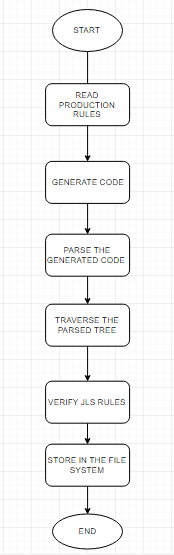
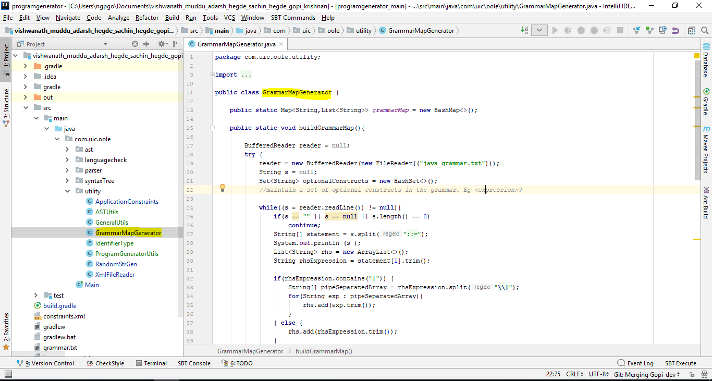
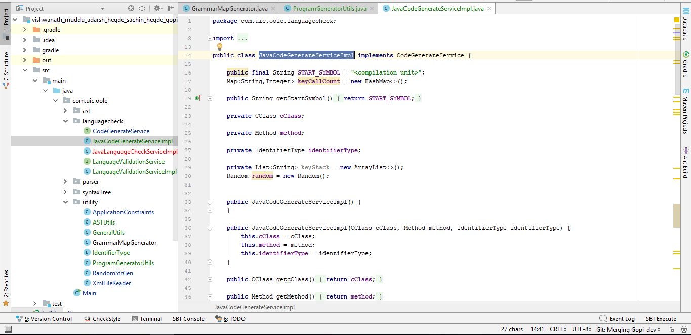
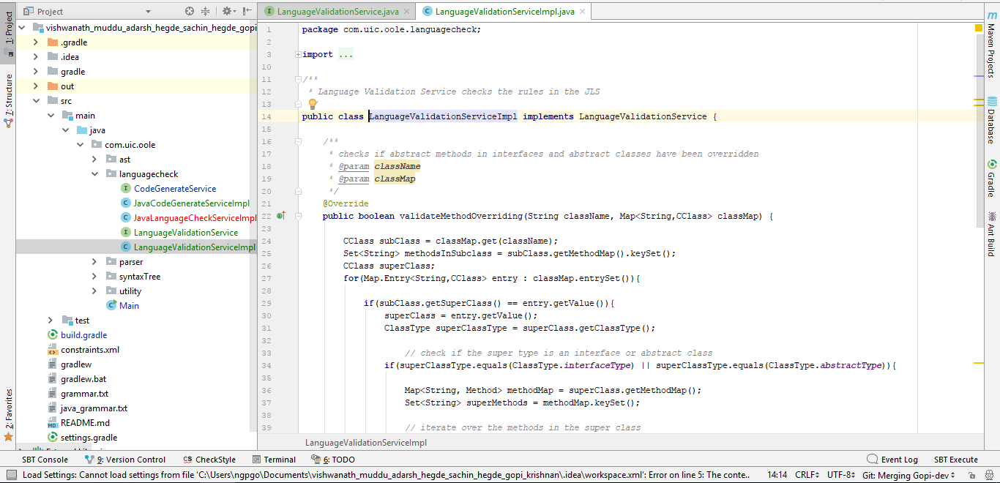
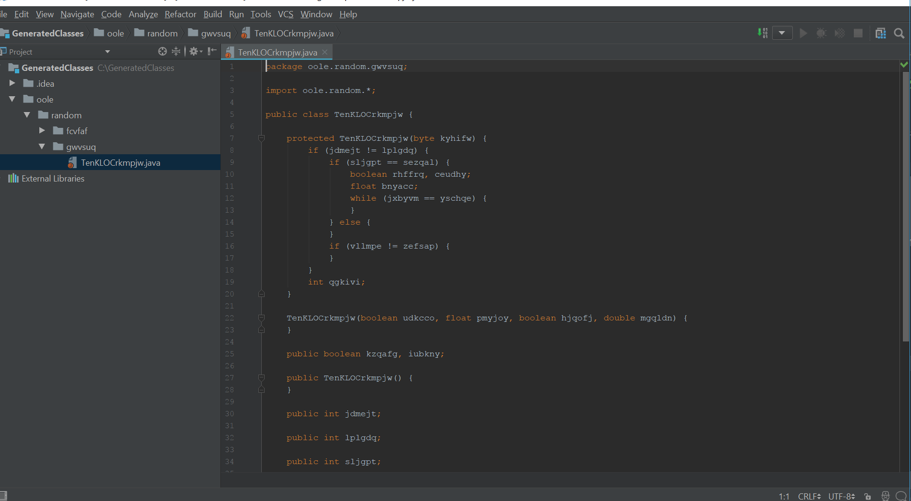
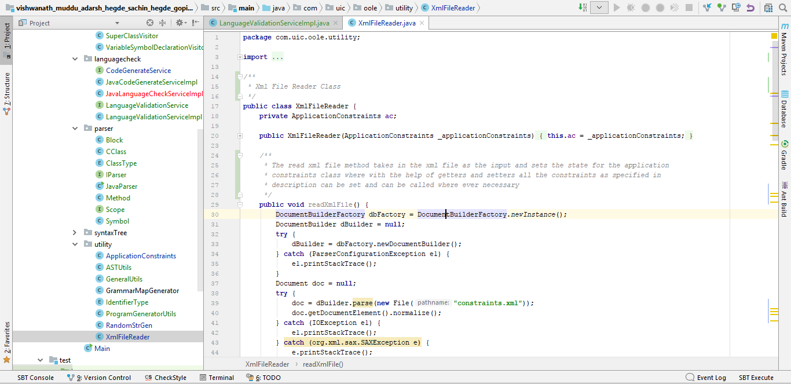

## _Objective_
To develop a randomly generated program that adheres to the Java Language Specification and Java grammar rules. The randomly generated code can be compiled, however the generate code is a meaning less program that has no logic to itself. The Application was built using the Java programming language that supports Java 1.8 JDK. IntelliJ has been promising over the years with cool features that improves dev time, so IntelliJ was the ideal IDE for us to start working on the project. 

The three main functions of the application are the following:

•	Implementing the production rules (Java Grammar) and generate code.

•	Parse the generated code, and later traverse the parse tree and implement JLS rules.

•	The semantically correct code is then stored as a .java file.

## _Implementing production rules (java grammar) and generate code_
The grammar is read from java_grammar.txt file and subsequent maps are created for the terminal and non-terminal nodes. The program recourses through the grammar map by growing the non-terminal nodes, and terminates until a terminal node is reached for each of the recursion. The generated code is appended in a string form. 

**GrammarMapGenerator.java** class builds the grammar maps from the java_grammar.txt

**JavaCodeGenerateServiceImpl.java** class creates random code by recursing through grammar maps.

## _Parsing the generated code and implementing java language rules_
The generated code is then parsed to create a parse tree using JAVA parser. Appropriate java syntax rules are implemented as and when tree is traversed through each node. The output of the parse tree is then written into .java class file. 

**LanguageValidationServiceImpl.java** class file generates the parse tree and checks for java language rules to check the syntax of the randomly generated code.

The output of the parsed tree is then stored as an .java class file in the file system 

## _Configuration parameters_
The configuration parameters as mentioned in the project description are read from the xml file, and the same constraints is realized during the code generation. 

**XmlFileReader.java** class is used to read the constraints specified in the configuration file.

## _How to run the application?_
•	Please resolve all your dependencies before running the application

•	The randomly generated program in saved in the **_GeneratedClasses_** folder that resides in the **_D:/_** drive in your file system

•	You need to create a folder named **_GeneratedClasses_** in the **_D:/_** drive

## _How to build the application?_
`gradle build`

## _Running the unit tests_
Test cases for all the possible scenarios were implemented. Test Coverage was pretty decent.

**_Reflection_** was used in accessing modifiers that were private

**_Mockito_** was implemented to mock classes

**_PowerMockito_** was used in mocking static members of the class

**_JUnit_** was used for running assertions between the actual and expected values

## _How to run the test suit?_
`gradle test`

## _Dependencies_
`testCompile group: 'junit', name: 'junit', version: '4.12'`

`testCompile group: 'org.mockito', name: 'mockito-all', version: '1.10.19'`

`testCompile group: 'org.powermock', name: 'powermock-api-mockito', version: '1.7.3'`

`testCompile group: 'org.powermock', name: 'powermock-module-junit4', version: '1.7.3'`

`compile group: 'sax', name: 'sax', version: '2.0.1'`

`compile group: 'org.apache.logging.log4j', name: 'log4j-core', version: '2.9.1'`
    
`compile group: 'org.apache.commons', name: 'commons-lang3', version: '3.0'`
    
`compile 'com.github.javaparser:javaparser-core:3.5.4'`

`compile group: 'commons-io', name: 'commons-io', version: '2.5'`